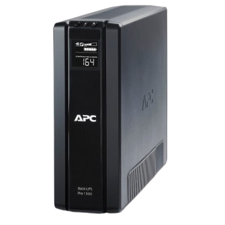

# 3 Tasca SAI, Projecte EverPia ⚡💻

## 1. Inventari d’equips 🧾
A la descripció tenim:
- 🖥️ 4 ordinadors de sobretaula
- 🖨️ 1 impressora-fotocopiadora multifunció
- 🌐 1 router d’accés a Internet

Dispositius que es connectaran al SAI:
- 🖥️ Monitor: Cal garantir que es puguin apagar correctament i evitar pèrdua de dades.
- 💾 Ordinadors: Necessaris per visualitzar i guardar treballs.
- 📶 Router: Mantenir la connexió pot ser útil per sincronització o treball remot.

## 2. Consulta de consum dels dispositius 🔋

| Dispositiu | Model estimat      | Consum (W) | Consum (VA) |
|-------------|--------------------|-------------|--------------|
| [Ordinador](https://www.hp.com/pe-es/shop/desktop-hp-prodesk-400-g6-7ze63la.html#features) | HP ProDesk 400 G6  | 180 W       | 225 VA       |
| [Monitor](https://www.dell.com/es-es/shop/monitor-dell-24-se2425hm/apd/210-bqzt/monitores-y-accesorios)   | Dell SE2425HM      | 12,8 W      | 16 VA        |
| [Router](https://www.tp-link.com/es/home-networking/wifi-router/archer-c6/)    | TP-Link Archer C6  | 10 W        | 12.5 VA      |

Total per unitat (PC + monitor):

180+20=200W⇒225+25=250VA  
Total per 4 equips + router:  
- ⚙️ **Watts:** (4×200)+10=810W  
- ⚙️ **VA:** (4×250)+12.5=1012.5VA

## 3. Càlcul amb reserva del 20% 🧮

1012.5×1.2=1215VA

## 4. Determinació de l’autonomia ⏱️

Autonomia mínima requerida: 10 minuts  
Això implica que el SAI ha de mantenir 810 W durant 10 minuts.

## 5. Recerca de models de SAI 🔍

| Model | Potència | Autonomia estimada | Sortides | Tipus | Preu aprox. |
|--------|-----------|--------------------|-----------|--------|--------------|
| [APC Back-UPS Pro BR1500G-GR](https://www.apc.com/ca/en/product/BR1500G/apc-backups-pro-1500va-865w-tower-120v-10x-nema-515r-outlets-avr-lcd-user-replaceable-battery/) | 1500 VA / 865 W | ~10–13 min a 800 W | 10 (5 amb bateria + 5 amb protecció) | Line-interactiva | 479.00 |
| [Salicru SPS 1200 Soho+](https://www.amazon.es/Salicru-SPS-1200-Soho-Sistema-alimentaci%C3%B3n-ininterrumpida/dp/B079FX7WR7?th=1) | 1200 VA / 720 W | ~10 min a 650 W (estimada) | 4 Schuko | Line-interactiva | 140.90 |
| [Trust Paxxon 1500VA](https://www.trust.com/en/product/23505-paxxon-1500va-uninterruptible-power-supply-ups-eu) | 1500 VA / 900 W | 7 min a 450 W / 80 s a 900 W | 4 Schuko | Line-interactiva amb AVR | 199.99 |

## 6. Conclusió i recomanació final ✅

Després d’analitzar les especificacions:
- ⭐ **Recomanat:** APC Back-UPS Pro BR1500G-GR  

**Motius:**
- ⚡ Potència suficient per cobrir els 1215 VA amb reserva.
- ⏳ Autonomia real superior als 10 minuts amb càrrega de 810 W.
- 🌍 Marca reconeguda internacionalment per fiabilitat.
- 🔌 Disposa de 10 sortides, ideal per connectar tots els equips.
- 🧠 Inclou pantalla LCD, software de gestió, i bateries reemplaçables.

[Tornar a enrera](./README.md) 🔙✨

