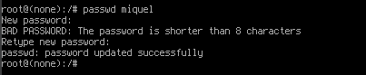
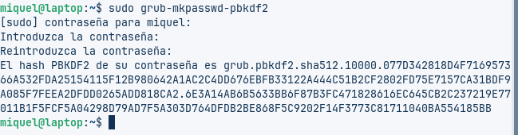
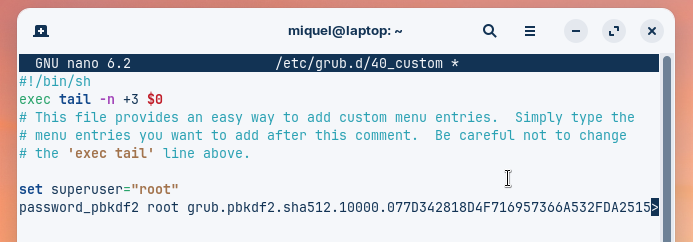
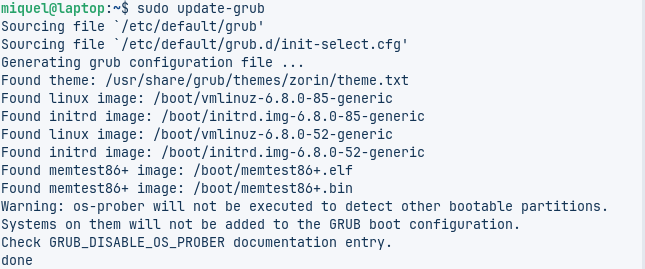
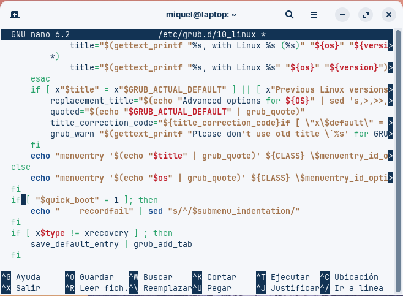

# 🔐 Recuperant l'accés i protegint el sistema (Seguretat Lògica)

## 🖥️ Pas 1: Crear la màquina virtual

Per començar, configurarem la màquina virtual.  
Li assignarem **8 GB de memòria RAM** i **2 processadors**.  
En aquest cas no afegirem cap disc nou, ja que utilitzarem una imatge **ISO** ja creada.

A la configuració del disc dur seleccionem l'opció:

> **Use an existing virtual hard disk file**

Triem la ISO corresponent, i amb això ja tindrem la màquina preparada per arrencar.

---

## 🔄 Pas 2: Canviar la contrasenya des del GRUB

Quan iniciem la màquina veurem que no coneixem la contrasenya de l’usuari,  
així que caldrà restablir-la entrant en **mode root**.

Per fer-ho, reiniciem la màquina i premem repetidament la tecla **Esc**  
fins que aparegui el menú del **GRUB**.  
Un cop dins, escrivim les següents línies per iniciar el sistema com a root:

- `linux /boot/vmlinuz-6.8.0-52-generic root=/dev/sda3 rw init=/bin/bash`

- `initrd /boot/initrd.img-6.8.0-52-generic`

- `boot`

Amb aquestes ordres, el sistema s’obrirà directament en una consola amb permisos de root.  
Quan hi tinguem accés, només cal escriure:

- `passwd miquel`

i podrem assignar una nova contrasenya a l’usuari.  
Després reiniciem la màquina, iniciem sessió amb la nova contrasenya  
i passem al següent pas: protegir el **GRUB**.

---

## 🛡️ Pas 3: Protecció bàsica del GRUB

Ara configurarem una contrasenya per al **GRUB**, així ningú podrà modificar-lo sense permís.  
Generem una contrasenya encriptada amb:

- `grub-mkpasswd-pbkdf2`

Ens demanarà una contrasenya, la repetim i ens mostrarà el **hash encriptat**.  
Copiem aquest hash i obrim el fitxer següent:

- `sudo nano /etc/grub.d/40_custom`

  

Al final del fitxer hi afegim aquestes dues línies:

- `set superusers="root"`
- `password_pbkdf2 root <enganxa_aquí_el_hash>`

Guardem els canvis amb:

**Ctrl + O → Enter → Ctrl + X**

Finalment, actualitzem la configuració del GRUB:

- `sudo update-grub`

💡 Amb això, el **GRUB** quedarà protegit.  
Cada vegada que s’intenti editar o arrencar el menú, demanarà usuari i contrasenya.  
Pot ser una mica molest si l’ordinador l’utilitza més d’una persona,  
però afegeix una capa important de **seguretat**.

---

## 🔧 Pas 4: Protecció avançada del GRUB

Ara ajustarem la configuració per aconseguir que el sistema s’iniciï sense demanar contrasenya,  
però que sí la sol·liciti si algú vol editar o accedir a opcions avançades.

Obrim el fitxer que genera les entrades del GRUB:

- `sudo nano /etc/grub.d/10_linux`

Com que el fitxer és llarg, podem buscar fàcilment amb:

**Ctrl + W →** escrivim “menuentry”

Això ens portarà directament a les línies que ens interessen.  
Just després del paràmetre `${CLASS}`, afegim:

- `--unrestricted`

Així indiquem que aquestes entrades es poden executar sense contrasenya,  
mentre que la resta (com l’edició o la consola del GRUB) quedaran protegides.  
Guardem (**Ctrl + O**, **Enter**, **Ctrl + X**)  
i actualitzem el GRUB novament:

- `sudo update-grub`

Reiniciem la màquina per comprovar que tot funcioni correctament.

---

## ✅ Resultat final

El sistema s’inicia automàticament **sense demanar contrasenya**.  
Si intentes editar el **GRUB** o accedir a opcions avançades, **demanarà usuari i contrasenya**.  
D’aquesta manera aconseguim una protecció equilibrada entre **seguretat i comoditat**.

[Tornar a enrera](./README.md)
